# 💬 Sentiric Messaging Gateway Service - Mantık ve Akış Mimarisi

**Belge Amacı:** Bu doküman, `messaging-gateway-service`'in Sentiric platformunun **"metin tabanlı iletişim köprüsü"** olarak stratejik rolünü, temel çalışma prensiplerini ve platformun asenkron dünyası (`RabbitMQ`) ile olan etkileşimini açıklar.

---

## 1. Stratejik Rol: "Evrensel Mesaj Tercümanı"

Bu servisin görevi, WhatsApp, Telegram, SMS gibi çok farklı metin tabanlı iletişim protokollerini, platformun anlayabileceği **tek bir standart olaya (`event`)** dönüştürmektir. `agent-service`'in WhatsApp'ın veya Telegram'ın API'sini bilmesine gerek yoktur; o sadece standart bir "yeni mesaj geldi" olayı alır.

**Bu servis sayesinde platform:**
1.  **Omnichannel Olur:** Sesli aramalara ek olarak metin tabanlı kanalları da destekleyerek gerçek bir "İletişim İşletim Sistemi" vizyonuna ulaşır.
2.  **Genişletilebilir Olur:** Yarın "Facebook Messenger" veya "Instagram DM" desteği eklemek, sadece bu servise yeni bir "adaptör" eklemeyi gerektirir.
3.  **Soyutlanmış Olur:** Her bir mesajlaşma platformunun kendine özgü kimlik doğrulama (QR kod, bot token), oturum yönetimi ve API karmaşıklığı bu servisin içinde saklanır.

---

## 2. Temel Çalışma Prensibi: Adaptörler ve Mesaj Kuyrukları

Servis, her bir iletişim kanalı için ayrı bir "adaptör" modülü barındırır ve tüm iletişimi `RabbitMQ` üzerinden yürütür.

*   **Gelen Mesajlar (Inbound):**
    1.  WhatsApp Adaptörü, bir kullanıcıdan yeni bir mesaj aldığında tetiklenir.
    2.  Bu mesajı, gönderenin kimliğini ve içeriğini içeren standart bir JSON formatına çevirir.
    3.  Bu standart JSON olayını, `call.events` (veya gelecekte `messaging.events`) adındaki RabbitMQ exchange'ine yayınlar.

*   **Giden Mesajlar (Outbound - Faz 2):**
    1.  Servis, `outgoing_messages` adında özel bir RabbitMQ kuyruğunu dinler.
    2.  `agent-service` gibi bir servis bu kuyruğa `{"channel": "whatsapp", "to": "...", "text": "..."}` formatında bir mesaj bıraktığında, bu servis mesajı alır.
    3.  `channel` alanına göre doğru adaptörü (WhatsApp Adaptörü) bulur ve mesajı ilgili kullanıcıya gönderir.

---

## 3. Uçtan Uca Mesaj Akışı

### Senaryo: Bir WhatsApp Mesajının Alınması

```mermaid
sequenceDiagram
    participant User as WhatsApp Kullanıcısı
    participant WhatsAppAPI as WhatsApp Web/API
    participant MsgGateway as Messaging Gateway
    participant RabbitMQ
    participant AgentService as Agent Service

    User->>WhatsAppAPI: "Merhaba"
    
    WhatsAppAPI-->>MsgGateway: (whatsapp-web.js) <br> 'message' olayı tetiklenir
    
    Note right of MsgGateway: Gelen mesajı standart bir <br> olay formatına çevirir. <br> { eventType: "message.received", channel: "whatsapp", ... }

    MsgGateway->>RabbitMQ: Olayı `call.events` exchange'ine yayınlar
    
    RabbitMQ-->>AgentService: Olayı tüketir
    
    Note over AgentService: Yeni bir metin tabanlı <br> diyalog döngüsü başlatır.
```

